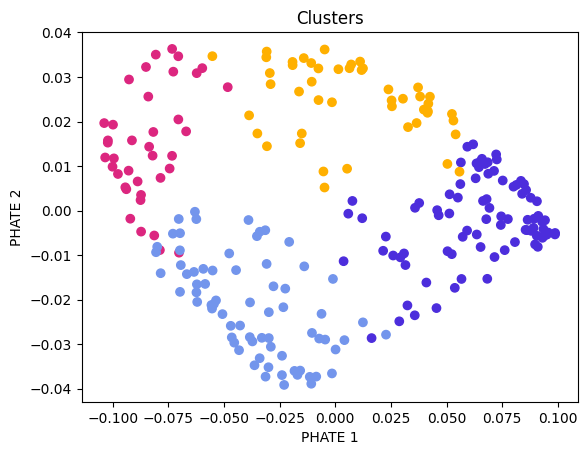

# covid-plasma-clusters

Notebook to reproduce the main results of our paper *Sustained IFN signaling is associated with delayed development of SARS-CoV-2-specific immunity*.

The easiest way to run the notebook is to upload `COVID_Plasma_Clusters_streamlined.ipynb` to [Google Colab](https://colab.research.google.com/).

